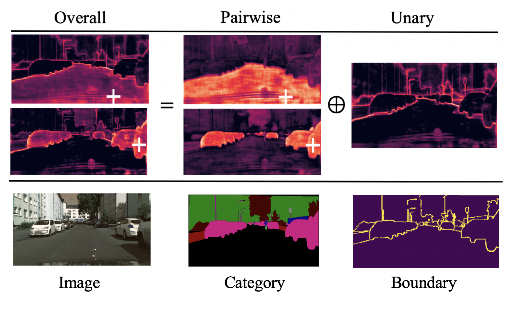
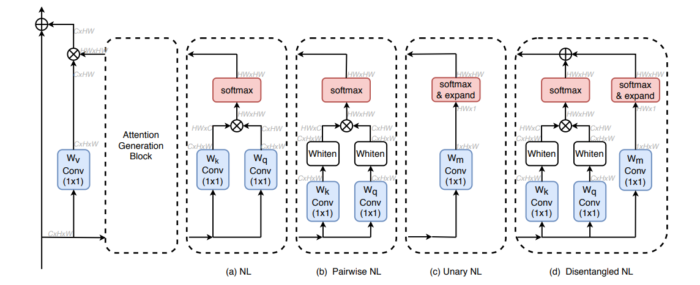

# Disentangled Non-Local Neural Networks

By Minghao Yin, Zhuliang Yao, [Yue Cao](http://yue-cao.me/), [Xiu Li](https://scholar.google.com/citations?user=Xrh1OIUAAAAJ&hl=zh-CN), [Zheng Zhang](https://stupidzz.github.io/), [Stephen Lin](https://scholar.google.com/citations?hl=zh-CN&user=c3PYmxUAAAAJ), [Han Hu](https://ancientmooner.github.io/).

We provide related codes and configuration files to reproduce the ["Disentangled Non-Local Neural Networks"](https://arxiv.org/pdf/2006.06668.pdf) on Cityscapes and ADE20K semantic segmentation. Our code is adapted from [torchcv](https://github.com/donnyyou/torchcv).

## Introduction 

The non-local block models long-range dependency in many computer vision tasks. Our paper first studies the non-local block in depth, where we find that its attention computation can be split into pairwise term and unary term. However, the two terms are tightly coupled in the non-local block, which hinders the learning of each. 
Based on that, we developed the disentangled non-local block, where the two terms are decoupled to facilitate learning for both terms. Disentangled non-local block outperforms non-local block in various tasks.

<div align="center">
  
</div>

The disentangled Non-local block composes of a whitened pairwise term accounting for the relationship between two pixels and a unary term representing the saliency of every pixel. The two terms are clearly decoupled by using independent Softmax functions and embedding matrices. As shown in the attention maps, the whitened pairwise term learns clear within-region clues while the unary term learns salient boundaries.

<div align="center">
  
</div>


## Citation
```
@article{yin2020disentangled,
  title={Disentangled Non-Local Neural Networks},
  author={Yin, Minghao and Yao, Zhuliang and Cao, Yue and Li, Xiu and Zhang, Zheng and Lin, Stephen and Hu, Han},
  journal={arXiv preprint arXiv:2006.06668},
  year={2020}
}
@misc{you2019torchcv,
    author = {Ansheng You and Xiangtai Li and Zhen Zhu and Yunhai Tong},
    title = {TorchCV: A PyTorch-Based Framework for Deep Learning in Computer Vision},
    howpublished = {\url{https://github.com/donnyyou/torchcv}},
    year = {2019}
}
```

## Install

### Requirements

- Linux or macOS (Windows is not currently officially supported)
- Python 3.6+
- PyTorch 1.0+
- CUDA 9.0+ 

a. Create a conda virtual environment and activate it.

```shell
conda create -n dnlnet python=3.6 -y
conda activate dnlnet
```
b. Install PyTorch and torchvision following the [official instructions](https://pytorch.org/), e.g.,

```shell
conda install pytorch torchvision -c pytorch
```

c. Clone the repository.

```shell
git clone https://github.com/yinmh17/DNL-Networks.git
cd DNL-Networks
```

d.Install build requirements 
```bash
pip3 install -r requirements.txt
cd exts
sh make.sh
```

## Train
Before training, you need to preprocess your datasets following the instruction in [datasets/seg/preprocess](https://github.com/yinmh17/DNL-Networks/tree/master/datasets/seg).
Download ImageNet pretrained model [3x3-Resnet101](https://drive.google.com/open?id=1bUzCKazlh8ElGVYWlABBAb0b0uIqFgtR)

You can use following commands to train your model.
```bash
bash ./scripts/seg/{DATASET}/{SCRIPT_FILE_NAME}.sh train {TAG} {DATA_DIR}  {PRETRAINED_MODEL} 
```

Optional arguments:
- `DATASET`: Name of the dataset, for example: "cityscapes", "ade20k".
- `SCRIPT_FILE_NAME`: Name of the bash file you are going to run. Training settings are contained in the bash file.
- `DATA_DIRECTION`: Directory of the preprocessed dataset.
- `PRETRAINED_MODEL`: Directory of  your pretrained model.

Take DNL network training on Cityscapes dataset for example, you need to run the following commands.
```bash
bash ./scripts/seg/cityscapes/run_fs_res101_nonlocalnowd_ln_cityscapes_seg.sh train tag  /torchcv/data/cityscapes   ./pretrained_models/3x3resnet101-imagenet.pth 
```

## Inference
After training, you can use following commands to validate your model.
```bash
bash ./scripts/seg/{DATASET}/{SCRIPT_FILE_NAME}.sh val {TAG} {DATA_DIR} 
```

Take DNL network validation on Cityscapes dataset for example:
```bash
bash ./scripts/seg/cityscapes/run_fs_res101_nonlocalnowd_ln_cityscapes_seg.sh val tag  /torchcv/data/cityscapes  
```

## Main Results

| Dataset | Model | Backbone | Train | Test | mIOU | Batchsize | Scripts |
|:--------|:---------|:------|:------|:------|:------|:------|:------|
| Cityscapes | DNL(nowd_in) | [3x3-Res101](https://drive.google.com/open?id=1bUzCKazlh8ElGVYWlABBAb0b0uIqFgtR) | train | val | [80.15](https://drive.google.com/drive/folders/1wp14HRKZjNzU5rjmDi4zen-w-0Z8LSMs) | 8 | [DNL_nowd_in](https://github.com/yinmh17/DNL-Networks/blob/master/scripts/seg/cityscapes/run_fs_res101_nonlocalnowd_in_cityscapes_seg.sh)|
| Cityscapes | DNL(nowd_ln) | [3x3-Res101](https://drive.google.com/open?id=1bUzCKazlh8ElGVYWlABBAb0b0uIqFgtR) | train | val | [80.12](https://drive.google.com/drive/folders/1LZDxjdr4z7MDTuOR0r_KZEuLNRkymFf_) | 8 | [DNL_nowd_ln](https://github.com/yinmh17/DNL-Networks/blob/master/scripts/seg/cityscapes/run_fs_res101_nonlocalnowd_ln_cityscapes_seg.sh)|
| Cityscapes | DNL(temp_in) | [3x3-Res101](https://drive.google.com/open?id=1bUzCKazlh8ElGVYWlABBAb0b0uIqFgtR) | train | val | [80.3](https://drive.google.com/drive/folders/1aDvuBFi9cFBxo87syPewpjR2eAvNUtv-) | 8 | [DNL_temp_in](https://github.com/yinmh17/DNL-Networks/blob/master/scripts/seg/cityscapes/run_fs_res101_nonlocal_in_cityscapes_seg.sh)|
| ADE20K | DNL(temp_in) | [3x3-Res101](https://drive.google.com/open?id=1bUzCKazlh8ElGVYWlABBAb0b0uIqFgtR) | train | val | [45.97](https://drive.google.com/drive/folders/1zTqdDcAyyWPZwTp3ktc7uDClAAwjjStc) | 16 | [DNL_temp_in](https://github.com/yinmh17/DNL-Networks/blob/master/scripts/seg/ade20k/run_fs_res101_nonlocalbn_ade20k_seg.sh)|
| Pascal Context | DNL(temp_in) | [3x3-Res101](https://drive.google.com/open?id=1bUzCKazlh8ElGVYWlABBAb0b0uIqFgtR) | train | val | [54.5](https://drive.google.com/file/d/1Z0KAd2-G1XWkvAmruH41LMO0iHCTQf7C/view?usp=sharing) | 16 | [DNL_nowd_ln](https://github.com/yinmh17/DNL-Networks/blob/master/scripts/seg/pcontext/run_fs_res101_nonlocalnowd_pcontext_seg.sh)|
